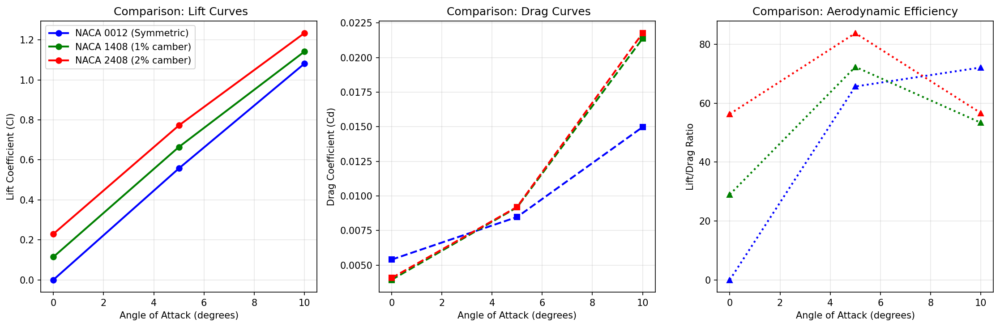
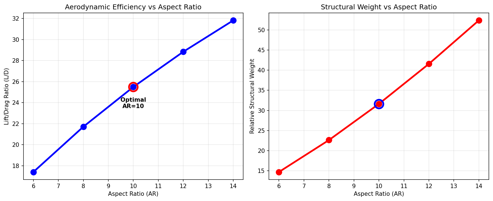

# Computational NACA Wing Aerodynamics Study

## Project Summary
Computational analysis comparing NACA 0012, 1408, and 2408 airfoils. Determined optimal aspect ratio (AR=10) considering aerodynamic efficiency vs structural weight.

## Results
- **Camber Effect:** Each 1% camber adds 0.115 Cl at zero angle
- **Best Airfoil:** NACA 2408 (L/D = 83.8 at α=5°)
- **Optimal AR:** 10 (balance of performance and weight)

## Results

## Tools Used
- **XFOIL** for 2D airfoil analysis
- **Python** for data processing and visualization
- **Aerodynamic Theory:** Lifting line, beam theory

## Files
- `*.py` - Python analysis scripts
- `*.txt` - Raw XFOIL data  
- `*.png` - Result plots
- `*.csv` - Excel chart
